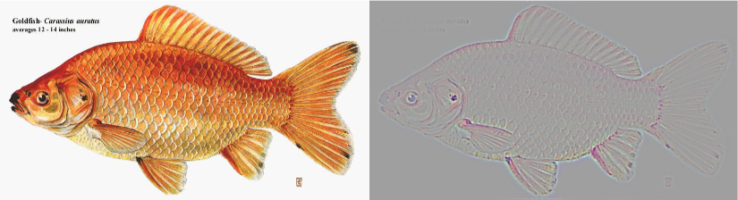
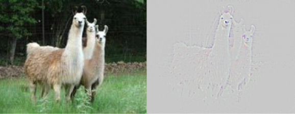

# Guided Backpropagation

- TensorFlow implementation of [Striving for Simplicity: The All Convolutional Net](https://arxiv.org/abs/1412.6806) (2014).
- Guided backpropagation generates clearer visulizations than [deconvnet](https://arxiv.org/abs/1311.2901) for higher layers.


## Requirements
- Python 3.3+
- [Tensorflow 1.3](https://www.tensorflow.org/)
- [TensorCV](https://github.com/conan7882/DeepVision-tensorflow) 

## Implementation Details

<!--- For MNIST dataset, a CNN with three convolutional layers followed by a global average pooling layer is used.-->

- [VGG19](https://arxiv.org/abs/1409.1556) is used for visulization. The model is defined in *CNN-Visualization/common/models/VGG.py*.
- Guided backpropagation copmutation class is defined in *CNN-Visualization/Guided_Backpropagation/guideBackpro.py*.
- Main function is in *CNN-Visualization/guidedbackpro.py*.


## Results
<div align='left'>
  
  
  
  
</div>

## Observations

## Preparation

1. Setup directories in file *CNN-Visualization/guidedbackpro.py*. 
  
    - *`IM_PATH`* - directory of testing image data
    - *`VGG_PATH`* - directory of pre-trained VGG19 parameters
    - *`SAVE_DIR`* - directory of saving result images
   
2. Download the pre-trained VGG parameters
       
    - Download pre-trained VGG19 model [here](https://github.com/machrisaa/tensorflow-vgg#tensorflow-vgg16-and-vgg19) and put it in *`VGG_PATH*.
         
       
3. Testing images
 
    - Put testing images in *`IM_PATH`* .
    - Change image type to the corresponding type if testing images are not jpeg files
    
      ```
      input_im = ImageFromFile('.jpg', data_dir=IM_PATH, num_channel=3, shuffle=False)
      ```
       

## Run Script:

To get the guided backpropagation maps for all the image in *`IM_PATH`*, just run:

```
python guidedbackpro.py
```	

- Results will be saved in *`SAVE_DIR`* as **map_IDX_class_PREDICT_LABEL.png**.   


## Author
Qian Ge


	
	


 
