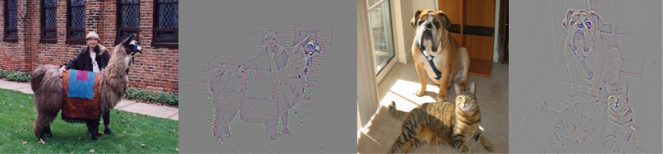

# Visualization of Deep Covolutional Neural Networks

- This repository contains implementations of visualizatin of CNN in recent papers.
- The source code in the repository can be used to demostrate the algorithms as well as test on your own data.

## Requirements
- Python 3.3+
- [Tensorflow 1.3](https://www.tensorflow.org/)
- [TensorCV](https://github.com/conan7882/DeepVision-tensorflow) 

## Algorithms 

- [Gradient-weighted Class Activation Mapping (Grad-CAM)](https://github.com/conan7882/CNN-Visualization/tree/master/doc/grad_cam#gradient-weighted-class-activation-mapping-grad-cam) (ICCV 17)
- [Class Activation Mapping (CAM)](https://github.com/conan7882/CNN-Visualization/tree/master/doc/cam#class-activation-mapping-cam) (CVPR 16)
- [Guided back propagation](https://github.com/conan7882/CNN-Visualization/tree/master/doc/guided_backpropagation#guided-backpropagation) (2014)

## Gradient-weighted Class Activation Mapping (Grad-CAM)
- Grad-CAM generates similar class heatmap as CAM, but it does not require to re-train the model for visualizatin.
- Details of the implementation and more results can be find [here](https://github.com/conan7882/CNN-Visualization/tree/master/doc/grad_cam#gradient-weighted-class-activation-mapping-grad-cam). Some results:

## Class Activation Mapping (CAM)
- The class activation map highlights the most informative image regions relevant to the predicted class. This map can be obtained by adding a global average pooling layer at the end of convolutional layers.
- Details of the implementation and more results can be find [here](https://github.com/conan7882/CNN-Visualization/tree/master/doc/cam#class-activation-mapping-cam). Some results:

## Guided back propagation
<!--- Guided backpropagation generates clearer visulizations than deconvnet for higher layers.-->

- Details of the implementation and more results can be find [here](https://github.com/conan7882/CNN-Visualization/tree/master/doc/guided_backpropagation#guided-backpropagation). Some results:

