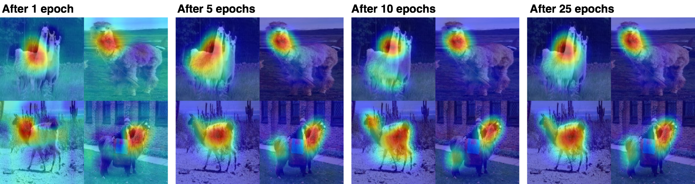

# Class Activation Mapping (CAM)

- TensorFlow implementation of [Learning Deep Features for Discriminative Localization](https://arxiv.org/abs/1512.04150) (CVPR'16).
- Caffe implementation by the authors is [here](https://github.com/metalbubble/CAM).
- The class activation map highlights the most informative image regions relevant to the predicted class. This map can be obtained by adding a global average pooling layer at the end of convolutional layers.
- This implementation has been tested on [Caltech-256](http://www.vision.caltech.edu/Image_Datasets/Caltech256/) dataset, and can be tested on your own dataset as well.

<!--- This implementation has been tested on MNIST and Caltech-256 dataset, and can be tested on your own dataset as well.-->

## Requirements
- Python 3.3+
- [Tensorflow 1.3](https://www.tensorflow.org/)
- [TensorCV](https://github.com/conan7882/DeepVision-tensorflow) 

## Implementation Details

<!--- For MNIST dataset, a CNN with three convolutional layers followed by a global average pooling layer is used.-->

- CAM of Caltech-256 dataset is obtained by finetuning [VGG19](https://arxiv.org/abs/1409.1556).
- CAM models are defined in [`CNN-Visualization/lib/models/cam.py`](../../lib/models/cam.py).
- Exampe usage of CAM is in [`CNN-Visualization/example/cam.py`](../../example/cam.py) (used for  Caltech-256 or other nature image dataset.). Directories are setup in file [`CNN-Visualization/example/config_cam.py`](../../example/config_cam.py).

## Results
<!--- ### MNIST-->

### Caltech-256

Class activation map for class llama at different steps during training


Class activation map for class duck and people after 25 epochs


Class activation map of same image for different classes


## Observations

## Preparation

1. Setup directories in file `config_cam.py`. 
  
      - Training
  
         `config.vgg_dir` - directory of pre-trained VGG19 parameters
       
         `config.data_dir` - directory of training image data
       
         `config.infer_data_dir` - directory of the image use for inference class activation map during training (put only one image)
       
         `config.checkpoint_dir` - directory of saving trained model (saved every 100 training steps)
       
         `config.summary_dir` - directory of saving summaries (saved every 10 training steps)
       
         `config.infer_dir` - directory of saving inference result (saved every 100 training steps)
       
      - Testing
      
         `config.model_dir` - directory of trained model parameters
     
         `config.test_data_dir` - directory of testing images
       
         `config.result_dir` - directory of saving testing images
       
2. Download dataset and pre-trained VGG parameters
 
    - Download [Caltech-256](http://www.vision.caltech.edu/Image_Datasets/Caltech256/) dataset and put it in `config.data_dir`.
    - Download pre-trained VGG19 model [here](https://github.com/machrisaa/tensorflow-vgg#tensorflow-vgg16-and-vgg19) and put it in `config.vgg_dir`.
       
## Train and test on Caltech-256:

Go to `CNN-Visualization/example/`, then

Finetuning pre-trained VGG19 for Caltech-256:

```
python cam.py --train --bsize BATCH_SIZE --label INFER_CLASS_LABEL
```	


Generate the class activation map using trained parameters

```	  
python cam.py --prediction --bsize BATCH_SIZE --model SAVED_MODEL_NAME --label INFER_CLASS_LABEL
```

**INFER_CLASS_LABEL** is the label of the class used to generate the inference class activation map.

- The scaled class activation map will be saved in `config.result_dir` along with a .mat file containing raw data of the map.
- If batch size is greater than 1, the result images of one mini batch will be save as one image.  
- **Batch size has to be one during testing if the testing images have different size.** Or you can resize the images to 224 x 224 by uncomment `resize = 224,` (line 83). Please refer to the code comments for more detailed parameters setting.  


## Train and test on your own dataset:

Go to `CNN-Visualization/example/`, then

Dataset requirement:

  1. Put training image in `config.data_dir`. Image of different classes are in different folders. Uncomment print(dataset_train.label_dict) to check the image class label and the corresponding label index for training and testing.
  2. The images have to be color images with 3 channels.
  3. May not work well on low resolution images, since all the images will be rescaled to 224 x 224 for training.
 
 
Finetuning pre-trained VGG19 for your own dataset:

   - The number of image classes and image file type needs to be specified:

```
python cam.py --train --bsize BATCH_SIZE --label INFER_CLASS_LABEL --nclass NUM_IMAGE_CLASS\
--type IMAGE_FILE_EXTENSION(start with '.')
```	

Generate the class activation map using trained parameters

```	  
python cam.py --prediction --bsize BATCH_SIZE --model SAVED_MODEL_NAME --label INFER_CLASS_LABEL\
--type IMAGE_FILE_EXTENSION(start with '.')
```


## Author
Qian Ge


	
	


 
