# CNN Feature Visuallization via Deconvnet

- TensorFlow implementation of [
Visualizing and Understanding Convolutional Networks](https://arxiv.org/abs/1311.2901) (ECCV'14).
- The features are visualized by mapping activations back to the input pixel space through several unpooling layers and deconvolutional layers.
- This implementation takes [VGG19](https://arxiv.org/abs/1409.1556) as example. 

## Requirements
- Python 3.3+
- [Tensorflow 1.3](https://www.tensorflow.org/)
- [TensorCV](https://github.com/conan7882/DeepVision-tensorflow) 

## Implementation Details

- Deconvnet for VGG19 is defined in [`CNN-Visualization/lib/nets/vgg.py`](https://github.com/conan7882/CNN-Visualization/blob/master/lib/nets/vgg.py#L307).
- Code of example usage of deconvnet visualization is in [`CNN-Visualization/example/deconv.py`](../../example/deconv.py).
- Images are rescale to proper size to git rid of size inconsistence issues when unpooling.
- Feature maps are first computed for a single image. Then pick one activation and set all other activations in the selected feature map to zero. Finally this new feature map is mapped back to input pixel space.
- Weights of filters of convnet and deconvnet are shared. The filters of the deconvnet is the transpose version of convnet filters.
- Switches are stored during forward pass. Reference of implementation of unpooling layer is [here](https://github.com/tensorflow/tensorflow/issues/2169).


## Results
### Caltech-256
left: reconstruction, right: original image. Both are cropped based on the receptive field of the activations.
#### Top 9 activations of all the feature map for each layer 
#### Across 'people' class images

Layer 1_2
<p align = 'left'>
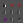

</p>
Layer 2_2
<p align = 'left'>
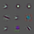
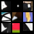
</p>
Layer 3_4
<p align = 'left'>
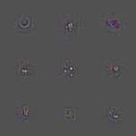
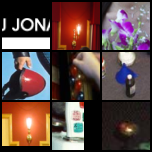
</p>
Layer 4_4
<p align = 'left'>
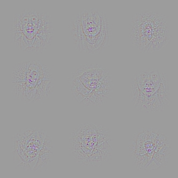
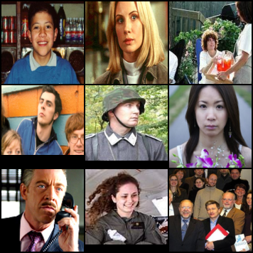
</p>
Layer 5_2
<p align = 'left'>
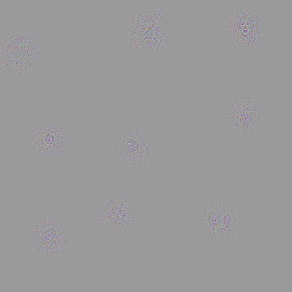
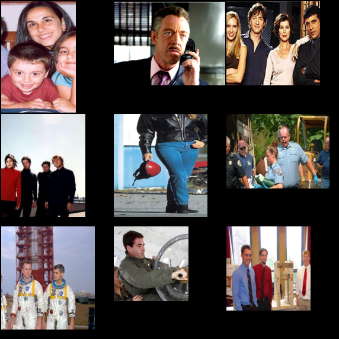
</p>

#### Across 'dog' class images

Layer 1_2
<p align = 'left'>
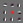

</p>
Layer 2_2
<p align = 'left'>
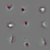
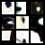
</p>
Layer 3_4
<p align = 'left'>

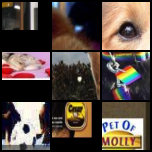
</p>
Layer 4_4 (The network is sensitive to both dog and human faces at this level.)
<p align = 'left'>
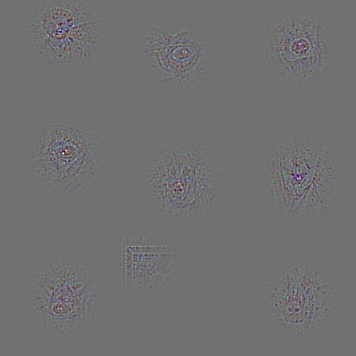
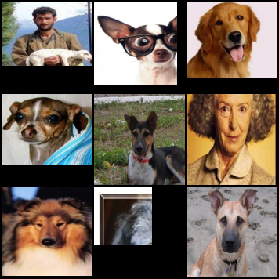
</p>
Layer 5_2 (The network is sensitive to both dog and human faces at this level.)
<p align = 'left'>
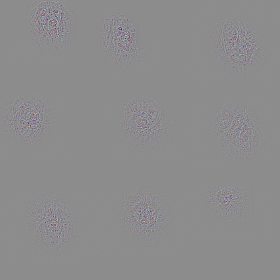
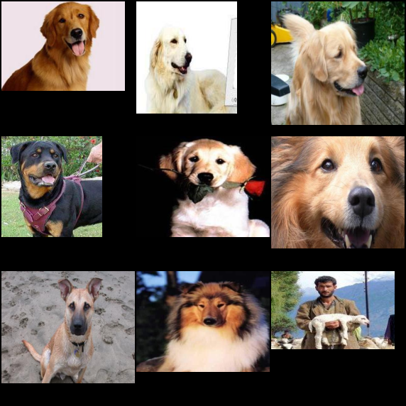
</p>


#### Top 9 activations of a fixed feature map for each layer 
Layer 2_2, Feature map 59, People (This feature map has high activations for curves.)
<p align = 'left'>
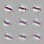
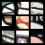
</p>
Layer 3_4, Feature map 166, People (This feature map is sensitive to 'O' shape patterns.)

<p align = 'left'>
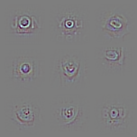
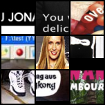
</p>
Layer 4_4, Feature map 349, Dog (It seems like this feature map is sensitive on faces (eyes with nose).)
<p align = 'left'>
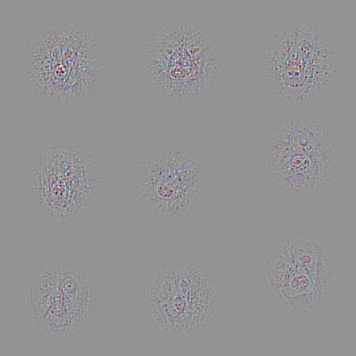
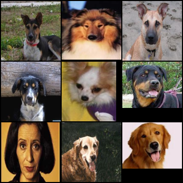
</p>
Layer 4_4, Feature map 171, Dog (This feature map is sensitive on the dog nose.)
<p align = 'left'>
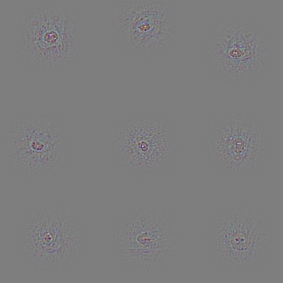
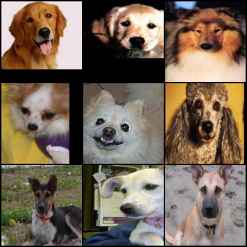
</p>
</p>
Layer 4_4, Feature map 171, People (This is the same feature map as the above figure but on 'people' images. Besides nose on dog faces, this feature map is also sensitive to some parts of human faces, such as eyes and month.)
<p align = 'left'>
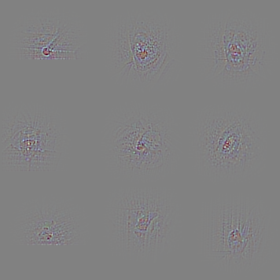
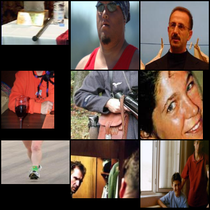
</p>


<!--## Observations-->

## Preparation

1. Setup directories in file `CNN-Visualization/example/config_path.py`. 
  
    - `im_path` - directory of testing image data
    - `vgg_path` - directory of pre-trained VGG19 parameters
    - `save_path` - directory of saving result images
   
2. Download the pre-trained VGG parameters
       
    - Download pre-trained VGG19 model [here](https://github.com/machrisaa/tensorflow-vgg#tensorflow-vgg16-and-vgg19) and put it in `vgg_path`.
         
         
## Run Script:

Go to `CNN-Visualization/example/`

To get the reconstruction image of top 9 activations of a specific layer (layer 4_4) across the test set (JPEG files):

```
python deconv.py --feat conv4_4 --imtype .jpg
```	

- All the test images will be rescaled to 224 x 224 before feed into VGG19.
- `--feat` is used to specify the name of feature layer. It can be `conv1_1`, `conv2_1` ... The fill list can be found [here](https://github.com/conan7882/CNN-Visualization/blob/master/lib/nets/vgg.py#L374).
- `--imtype` is used to specify the test image type. It can be .jpg or .png or other types of images.
- The cropped and merged reconstruction and original images are saved `save_path` as
**LAYER_NAME_feat.png** 
and **LAYER_NAME_im.png** 

To get the reconstruction image of top 9 activations of a specific feature map (350) at a specific layer (layer 4_4) across the test set (JPEG files):

```
python deconv.py --feat conv4_4 --imtype .jpg --id 350
```	

- `--id` is used to specify feature map what to check.

## Author
Qian Ge
