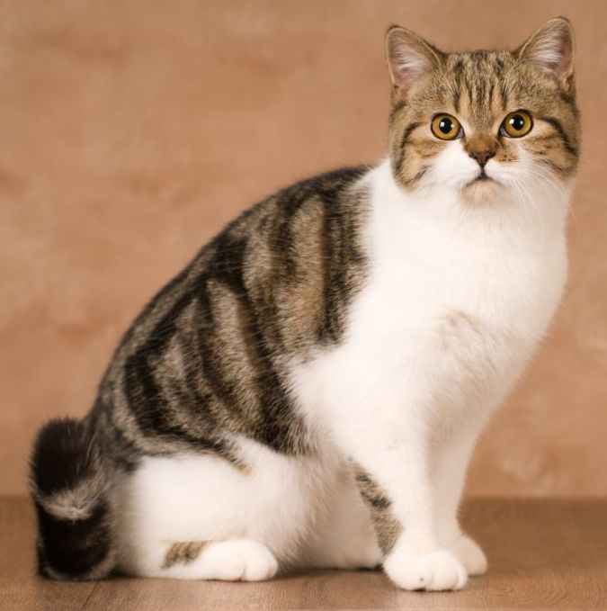
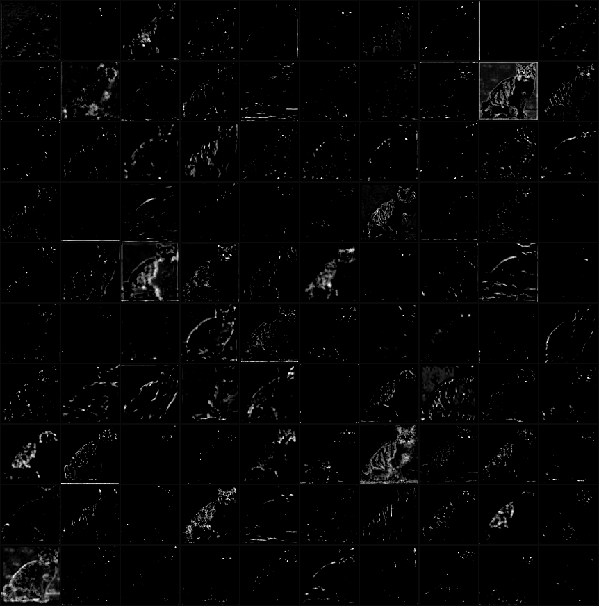
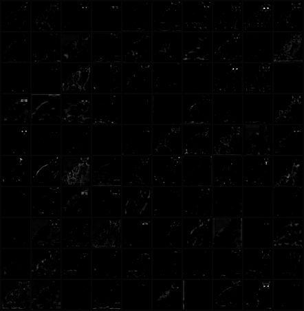
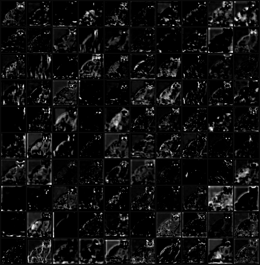
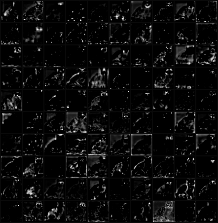
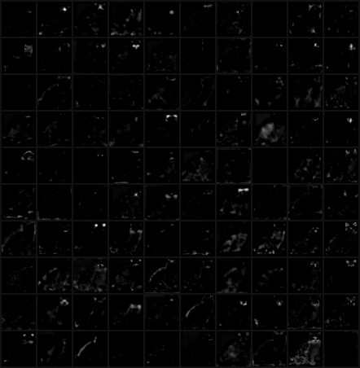
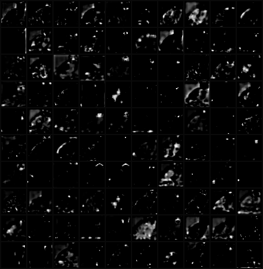
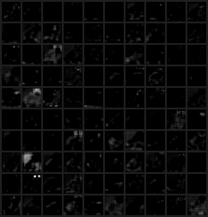
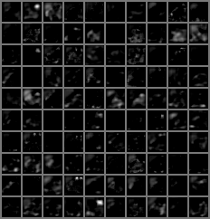

# Visualization of filters and feature maps of GoogLeNet

- The most straightforward approach to visualize a CNN is to show the feature maps (activations) and filters.
- Here are some examples of visualization of the first layer filters (7 x 7 x 3 x 64) and feature maps of the pre-trained GoogLeNet.

## Requirements
- Python 3.3+
- [Tensorflow 1.3](https://www.tensorflow.org/)
- [TensorCV](https://github.com/conan7882/DeepVision-tensorflow) 

## Results
<!--- ### MNIST-->

### First layer fiters (7 x 7 x 3 x 64)

We can see some high-frequency grayscale features as well as some low-frequency color features.

<p align = 'left'>

</p>

### Feature maps with ReLU (Randomly choose 100 feature maps to display)

- Input image
<p align = 'left'>

</p>

- Layer 3 (Inception3a and Inception3b)
<p align = 'left'>


</p>

- Layer 4 (Inception4a - Inception3e)
<p align = 'left'>





</p>

- Layer 5 (Inception5a and Inception5b)
<p align = 'left'>


</p>


## Usage
### Download pre-trained model
Download the pre-trained parameters [here](http://www.deeplearningmodel.net/).
### Config path
All directories are setup in [`example/setup_env.py`](../../example/config_path.py).

- `googlenet_path` is the path of the pre-trained model.
- `im_path` is the directory of testing image.
- `save_path` is the directory to save filter image. 
       
## Run the code:

Go to `CNN-Visualization/example/`, then


```
python vizfilter.py --feature --filter --im IMAGE_FILENAME
```	

Image will be saved in `config.save_path`  


## Author
Qian Ge


	
	


 
