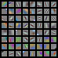

# Visualization of first layer filters

- Visualization of the first layer filters of GoogLeNet (7 x 7 x 3 x 64)


## Requirements
- Python 3.3+
- [Tensorflow 1.3](https://www.tensorflow.org/)
- [TensorCV](https://github.com/conan7882/DeepVision-tensorflow) 


## Results
<!--- ### MNIST-->

### GoogLeNet
<p align = 'left'>

</p>


## Usage
### Download pre-trained model
Download the pre-trained parameters [here](http://www.deeplearningmodel.net/).
### Config path
All directories are setup in [`example/setup_env.py`](../../example/config_path.py).

- `googlenet_path` is the path of the pre-trained model.
- `save_path` is the directory to save filter image. 
       
## Run the code:

Go to `CNN-Visualization/example/`, then


```
python vizfilter.py
```	

Image will be saved in `config.save_path`  


## Author
Qian Ge


	
	


 
